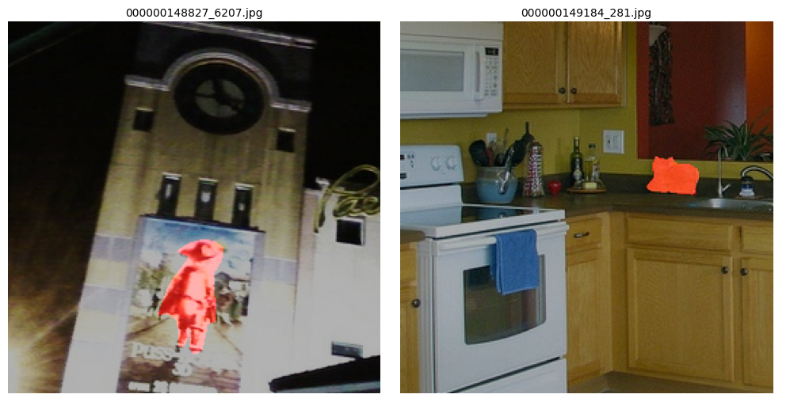
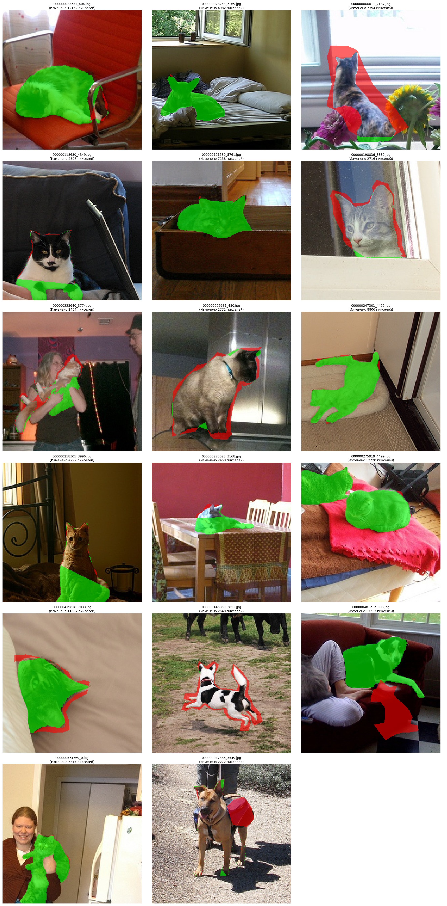
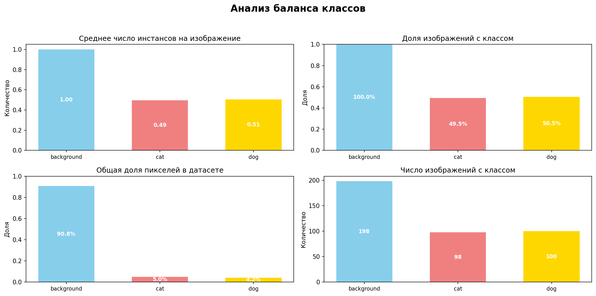
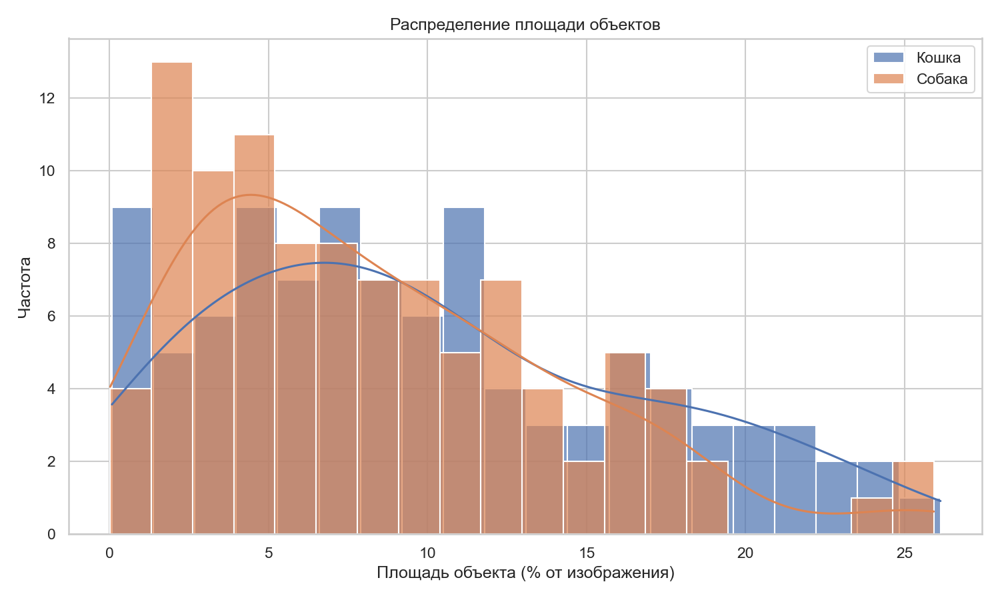

# Проект: **Выбор и обучение модели из mmsegmentation для задачи мультиклассовой семантической сегментации**

# Цель проекта
Нужно пройти полноценный пайплайн обучения модели семантической сегментации.
Проект считается выполненным при **mDIce > 0.75**.

# Этапы проекта
1. Исследовательский анализ (EDA)
2. Формирование первичных гипотез (бейзлайн-модель)
3. Эксперименты по улучшению качества модели
4. Заключение и выбор лучшего эксперимента

---

# Этап 1. Исследовательский анализ (EDA)
Ноутбук [**EDA_report.ipynb**](practicum_work/reports/EDA_report.ipynb) содержит подробное описание этапа с вызовом скриптов и сохраненными результатами обработки.

## Общая структура данных
Датасет **train_dataset_for_students** содержит 440 изображений размера 256×256 пикселей, разделённых на три части: 200 train, 120 val, 120 test.
- Размер всех изображений: **256×256×3** (RGB, uint8)
- Размер всех масок: **256×256** (grayscale, uint8)
- Уникальные значения в масках: `[0, 1, 2]`
  - `0` — фон
  - `1` — кошка
  - `2` — собака

```
train_dataset_for_students/
    ├── img/
    │ ├── test/ (120 .jpg)
    │ ├── train/ (200 .jpg)
    │ └── val/ (120 .jpg)
    └── labels/
      ├── test/ (120 .png)
      ├── train/ (200 .png)
      └── val/ (120 .png)
```

## Анализ качества данных
Выполним ряд автоматизированных проверок датасета, чтобы выявить некачественные семплы и решить какую стратегию обработки выбрать.

### 1. Проверка соответствия изображений и масок
- Все файлы имеют пары

### 2. Проверка корректности размеров изображений и масок
- Все изображения и маски имеют правильный размер.

### 3. Проверка классов в масках
- Все маски имеют допустимые классы.

### 4. Проверка пересечения классов: один пиксель — два объекта
- Пересечение классов не обнаружено.

### 5. Проверка пустых и полностью заполненных масок
- Нет масок без объектов и масок полностью заполненных объектами

### 6. Проверка на "дробные" объекты: слишком много отдельных компонент
- Слишком много фрагментов объекта (7): 000000016206_4014.png
- Слишком много фрагментов объекта (8): 000000121530_5761.png
- Слишком много фрагментов объекта (6): 000000247301_4455.png
- Слишком много фрагментов объекта (6): 000000308687_3712.png

### 7. Проверка шума в масках
- Маска 000000016206_4014.png содержит 5 мелких фрагментов (возможно, шум)
- Маска 000000121530_5761.png содержит 4 мелких фрагментов (возможно, шум)
- Маска 000000246879_5659.png содержит 2 мелких фрагментов (возможно, шум)
- Маска 000000275919_4499.png содержит 1 мелких фрагментов (возможно, шум)
- Маска 000000285257_4973.png содержит 1 мелких фрагментов (возможно, шум)
- Маска 000000307073_1489.png содержит 1 мелких фрагментов (возможно, шум)
- Маска 000000308687_3712.png содержит 2 мелких фрагментов (возможно, шум)
- Маска 000000310262_1601.png содержит 2 мелких фрагментов (возможно, шум)
- Маска 000000328760_6588.png содержит 1 мелких фрагментов (возможно, шум)
- Маска 000000474434_3544.png содержит 1 мелких фрагментов (возможно, шум)
- Маска 000000574769_0.png содержит 2 мелких фрагментов (возможно, шум)
- Маска 000000026310_3053.png содержит 1 мелких фрагментов (возможно, шум)
- Маска 000000209731_4128.png содержит 1 мелких фрагментов (возможно, шум)
- Маска 000000258129_3143.png содержит 1 мелких фрагментов (возможно, шум)
- Маска 000000324772_4097.png содержит 1 мелких фрагментов (возможно, шум)
- Маска 000000352558_5800.png содержит 2 мелких фрагментов (возможно, шум)
- Маска 000000358545_4807.png содержит 2 мелких фрагментов (возможно, шум)

### 8. Проверка формы объекта
- Высокое соотношение сторон (11.00): 000000121530_5761.png
- Высокое соотношение сторон (8.50): 000000247301_4455.png

### 9. Проверка на "дыры" внутри объектов
- Больших дыр внутри объектов не обнаружено

## Выявленные проблемы в разметке:
1. **Неточность границ**: у многих животных (особенно у ушей, хвостов, лап) маски обрезаны или смещены.
2. **"Дыры" в масках**: внутри тела животного встречаются пиксели фона (значение 0).
3. **Лишние включения**: части фона (ковры, подушки) случайно включены в маску объекта.

## Принятая стратегия обработки:
В ходе автоматических проверок был обнаружен ряд проблемных масок, которые нужно исправить.
Ввиду небольшого размера датасета проведем дополнительный визуальный контроль и ручную доразметку масок с помощью утилиты [**LabelMe**](https://github.com/wkentaro/labelme).

## Результаты доразметки
**Удалены** 2 файла, на которых в качестве кошек были выделены другие объекты.


**Доразмечены** 299 масок. Ниже приведены примеры с наибольшими изменениями.


---

## EDA

### Баланс классов

Подсчёт выполнено по всем 198 маскам обучающей выборки.

| Класс  | Число изображений с классом | Доля изображений с классом (%) | Среднее число инстансов на изображение | Общая доля пикселей (%) |
|--------|-----------------------------|--------------------------------|----------------------------------------|-------------------------|
| cat    |                       98    |                       49.5     |                              0.49      |              54.4       |
| dog    |                      100    |                       50.5     |                              0.51      |              45.6       |


> 📊 **Вывод**: классы **практически сбалансированы**.

---

### Распределение площади объектов

📊 Статистика по площадям объектов (в % от изображения):
| Класс  | Число объектов | Средняя площадь (%) | Медиана площади (%) | Min (%) | Max (%) |  25% (%) | 75% (%) |
|--------|----------------|---------------------|---------------------|---------|---------|----------|---------|
| cat    |         120    |            8.27     |           7.39      | 0.01    | 26.13   |  1.76    | 12.22   |
| dog    |         107    |            7.77     |           6.12      | 0.02    | 25.92   |  3.25    | 11.46   |



---

### Специфичные проблемы домена

- **Сложные позы**: животные лежат, свернулись калачиком → маски имеют нестандартные формы.
- **Одинаковый цвет с фоном**: светлые животные на светлом фоне (проблема для low-contrast).
- **Прозрачные и тонкие структуры**: ошейники, лапы на решётках — могут не попасть в разметку.
- **Маленькие объекты**: шерсть, усы — не размечены, но важны для границ.

---

### 5. Выводы и рекомендации

1. **Датасет маленький и зашумлённый**, но пригоден для обучения при использовании:
   - Transfer learning
   - Аугментаций
   - Тщательного валидационного контроля
2. **Чистка выполнена**: удалены 2, исправлены 299 файлов.
3. **Размер 256×256** — подходит для лёгких моделей (UNet, SegFormer-Ti).
4. **Рекомендуется использовать**:
   - Аугментации: эластичные деформации, гауссовский шум, блюр
   - Предобученные модели (ImageNet → COCO → дообучение)
   - mDice как основная метрика (учитывает дисбаланс)

---